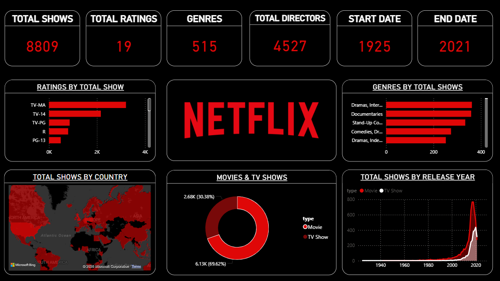

# 🎬 Netflix Content Analytics Dashboard

## 📌 Overview

Developed an interactive Power BI dashboard to analyze Netflix’s content library and uncover key trends in content distribution, growth, and audience targeting.

This project focuses on transforming raw dataset information into meaningful business insights through effective data visualization and dashboard design.

---

## 🧩 Problem Statement

With the rapid expansion of streaming platforms, understanding content trends is critical for strategic decision-making.

This dashboard aims to:

* Provide a clear view of content distribution across categories
* Identify growth patterns over time
* Highlight dominant genres and content ratings
* Enable quick, data-driven insights through interactivity

---

## ⚙️ Tools & Technologies

* **Power BI** – Dashboard development & data visualization
* **Dataset** – Netflix dataset sourced from Kaggle

---

## 📊 Key Features

* Interactive dashboard with dynamic filtering capabilities
* KPI indicators for quick overview of content metrics
* Year-wise trend analysis of content addition
* Genre and rating distribution insights
* Country-level content analysis
* Clean, user-focused dark theme UI for better readability

---

## 📈 Key Insights

* Content addition accelerated significantly post-2015, indicating platform expansion
* Movies form the majority of Netflix’s content catalog
* High concentration of content in specific regions suggests targeted market focus
* Certain genres (e.g., Drama, International content) consistently dominate the platform
* Increasing diversity in content categories over recent years

---

## 📷 Dashboard Preview

---

## 📂 Dataset Information

The dataset contains structured information on Netflix titles, including:

* Content type (Movie / TV Show)
* Genre classification
* Release year
* Rating
* Country of production

---

## 🎯 Outcome

* Transformed raw data into actionable insights using visualization techniques
* Designed an intuitive and interactive dashboard for end-user analysis
* Strengthened ability to communicate insights through data storytelling

---

## 🚀 Scope for Enhancement

* Integration with live or updated datasets
* Advanced drill-through and user interaction features
* Deeper analytical layers (trend forecasting, segmentation)

---

## 📎 Project Assets

* Power BI file (.pbix)
* Dataset 
* Dashboard screenshot

---
